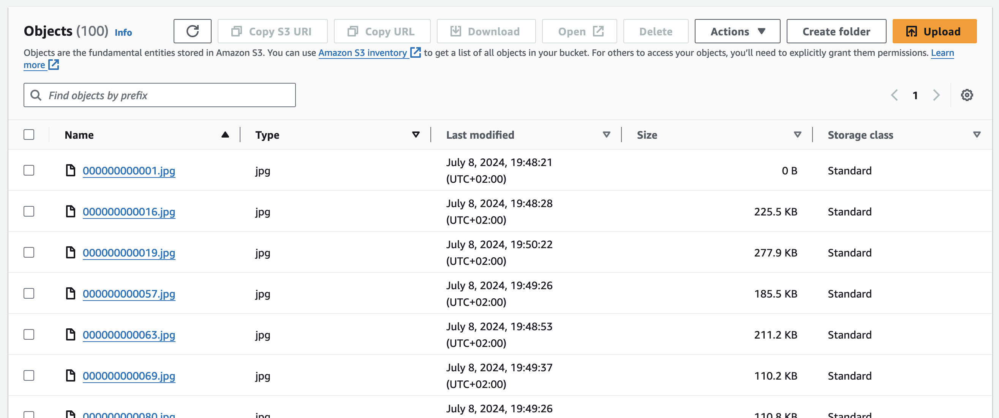
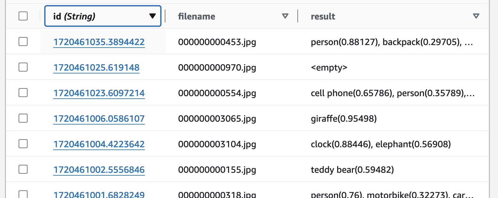
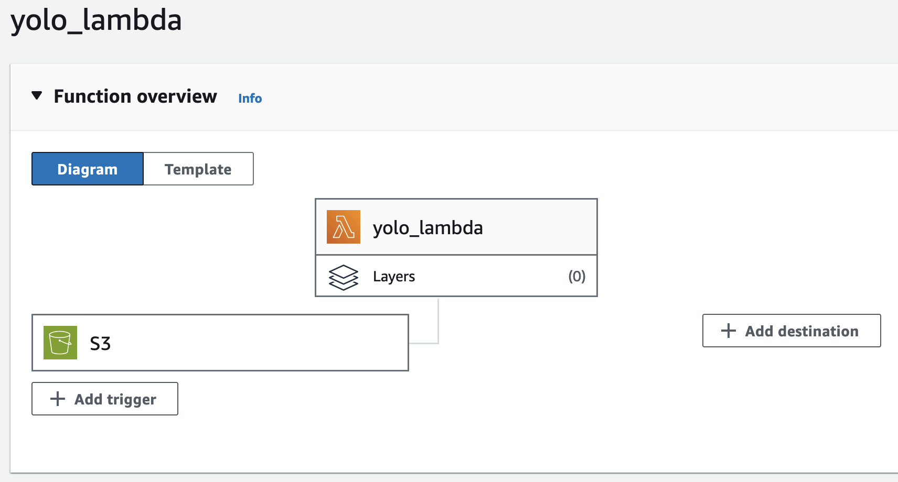

\newpage

# Introduction
In this report we present our solution of the third assignment for the course Data-Intensive Computing,
which contained 2 main parts: 1. Building a flask server to locally run object detection and 2. Adapting the previously built program to run as a lambda function on AWS.

# Problem overview

The aim of this exercise is to build an object detection application and test it both locally and on AWS.

## YOLO model

We are using a pretrained model called YOLOv3 (You Only Look Once version 3) tiny.
Since it is pretrained it can be used for prediciton straight away.
The threshold for detection has been set to 0.2 simply to reduce the amount of images with no deteced objects and increase variety.

## Data set

To test our solutions we are provided with 100 unlabled images.

# Local execution
## Server

A flask server is createded to implement the required RESTful API.
It receives the image in its base64 representation, stores it to a temporary folder and uses the locally built darknet implementation.

The darknet provides a detection fuction which is given the image along side weights and configuration and returns a list of objects, accuracy and the bounding boxes.
Since we don't need the require the bounding boxes we drop this information and collect to rest of the information in the required format to return to the client.

## Client

The client is a straight forward python script which iterates over all images in a specified folder and sends in one by one to the flask server.
We track the time and print each result to the console since there is no requirement to store it.

## Response time

On an current Macbook Air the average time it took the flask server to return the result is 0.42 seconds.

# Remote execution

All of the AWS files are on the account of Julian Flür and thus the result can be accessed in the data base on this account.

## S3 bucket

There are two S3 buckets.
The first one named ```jfimages``` has the purpose of storing the images on which we want to detect the images.
Secondly we have a bucket to store the YOLOv3-tiny weights file since it is "large" in the context of lambda function files.



## DynamoDB

The data base is used to store the results of the object detection.
For each image the lambda funciton's result is one row in the results table.
As id the current time stamp is used in addition to the result the filname is also stored.



## Lambda function

The most important building block of the whole setup is the lambda function.
We have set a trigger which executes the lambda funciton when a file in the S3 bucket is created.

The lambda function works very similar to the flask server.
When it is triggered by an upload we read the bucket and filename from the json.



Then we load the weights to a temporary file to create the model in the current environment.
All the other files are included in the lambda function since they are small enough.

Once the model is created, we can load the uploaded image to another temporary file and call the detection function provided by the darknet.

When we created the lambda function we encountered some issues which we'd briefly like to highlight:

- Since the darknet was initially built on Apple M3 architecture it could not be used in the AWS environment.
Once we rebuild it on a x86_64 machine we were able to use it with the darknet files on AWS.

- The default configuration for the compute resource of the lambda function was to small for the model.
Therefore we had to increase memory and storage size.
Since we were not hard pressed to optimized we chose both big enough.
If we were very cost concious, we could optimize these.

We utilized the test functionality provided by AWS while developing the lambda function.
This feature allows us to simulate a image creation event on a bucket without going through the steps of uploading an actual image.
Conviniently Amazon provides json templates, which can easily be adapted for any use case.

## Upload script

Very similar to the client of the flask server the upload script is straight forward.
It iterates over all the images in the input folder and uploads them using the boto3 library.
Also the average time is calculated.

## Cost

Since we were on a budget when developing the service, we'd like to mention the amount of money spent for developing and running the service for the data set.
We spent only a few cents on the whole project.
The benefit of the serverless execution is that we are only billed for the actual computing time and we don't have to rent a computing resource for the idle time.
Because each object detection takes only a few seconds the total computing time for the whole data sets is relatively low as well.

## Execution time

The time it takes to upload an image to the S3 bucket was measured in the upload script.
Over all the images in the data set we have an average upload time of 1.31 seconds.
Finally the average time it takes to detect the objects on AWS is 2.66 seconds.

In total it takes longer to run the model on AWS however this result is just for a tiny model.
If we were to use a larger model, where our PC would reach their performance limits it will be cheaper and faster to rent high performance cloud resources to run the model.
